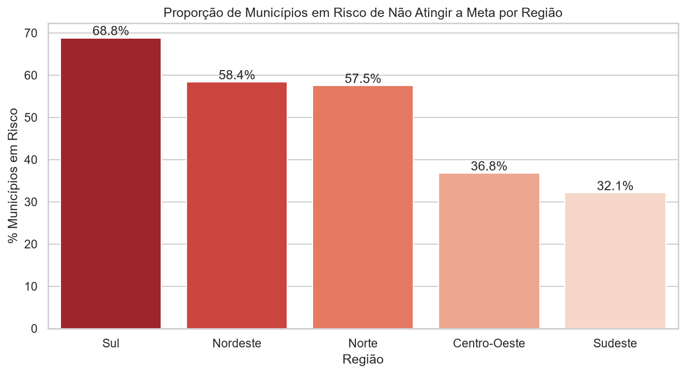
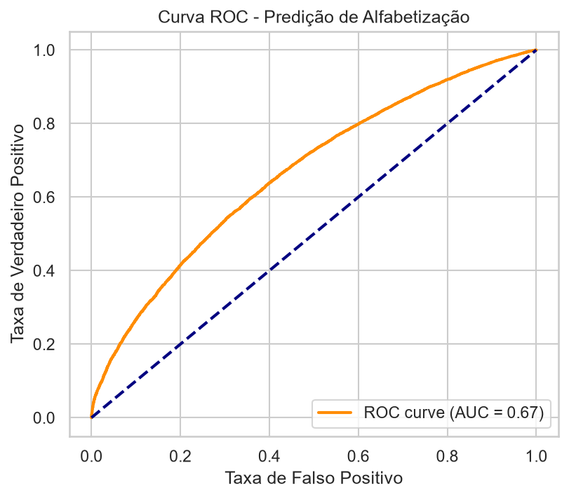
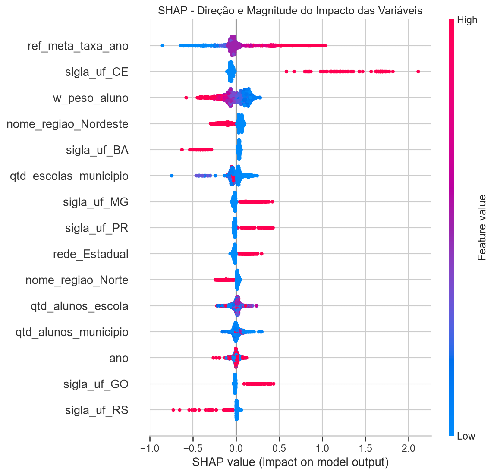

# Tech Challenge Fase 3 — Predição e Inteligência Analítica para Alfabetização no Brasil

Link [vídeo apresentação executiva Projetos]: https://www.youtube.com/watch?v=blFwum69Bcs

Modelo supervisionado que prevê se um aluno será considerado **alfabetizado** ou
**não alfabetizado** a partir de variáveis educacionais e territoriais, com
tradução dos resultados em inteligência aplicável à política pública.



---

## Sumário

- [1. Contexto do problema](#1-contexto-do-problema)
- [2. Objetivo analítico](#2-objetivo-analítico)
- [3. Base de dados](#3-base-de-dados)
- [4. Estrutura do repositório](#4-estrutura-do-repositório)
- [5. Como reproduzir](#5-como-reproduzir)
- [6. Etapas de modelagem](#6-etapas-de-modelagem)
- [7. Escolha do algoritmo](#7-escolha-do-algoritmo)
- [8. Métricas de avaliação](#8-métricas-de-avaliação)
- [9. Interpretação dos resultados](#9-interpretação-dos-resultados)
- [10. Insights encontrados](#10-insights-encontrados)
- [11. Limitações do projeto](#11-limitações-do-projeto)
- [12. Aplicação prática para políticas públicas](#12-aplicação-prática-para-políticas-públicas)
- [13. Possíveis evoluções futuras](#13-possíveis-evoluções-futuras)
- [14. Relatórios completos](#14-relatórios-completos)

---

## 1. Contexto do problema

A alfabetização infantil é um dos principais indicadores de desenvolvimento
educacional e social do país. Conhecer o indicador atual, porém, não basta para
decidir: gestores públicos precisam **antecipar riscos**, **identificar regiões
vulneráveis** e **entender quais fatores mais pesam** no resultado.

Na Fase 2 deste desafio foi construída a pipeline de engenharia de dados que
integra o Indicador Criança Alfabetizada, metas municipais e estaduais, dados
territoriais e populacionais em uma camada Gold no BigQuery. Esta fase consome
essa camada para produzir modelos preditivos e inteligência analítica.

## 2. Objetivo analítico

**Prever a alfabetização em nível de aluno** (classificação binária) e, a partir
das probabilidades estimadas, responder a perguntas de negócio:

- Quais fatores mais impactam a alfabetização?
- Quais municípios apresentam maior risco educacional?
- Quais regiões possuem padrões semelhantes?
- Como prever municípios que podem não atingir metas futuras?
- Quais variáveis possuem maior influência nos modelos?

## 3. Base de dados

Base analítica (ABT) em nível de aluno, extraída da camada Gold construída na
Fase 2 (`gold.alunos_features`). A modelagem usa uma **amostra determinística
de 5%**, definida por hash do `id_aluno` no BigQuery — sempre as mesmas linhas a
cada execução.

| | |
| --- | ---: |
| Alunos | 167.791 |
| Colunas | 17 |
| Municípios | 5.173 |
| Alfabetizados | 59,14% |
| Não alfabetizados | 40,86% |

| Grupo | Variáveis |
| --- | --- |
| Identificadores (removidos) | `id_aluno`, `id_escola`, `id_municipio` |
| Alvo | `y_alfabetizado` (1 = Sim, 0 = Não) |
| Territoriais | `sigla_uf`, `nome_regiao`, `nome_municipio` |
| Educacionais | `serie`, `rede`, `ano` |
| Porte | `qtd_alunos_escola`, `qtd_alunos_municipio`, `qtd_escolas_municipio` |
| Referência de meta | `ref_meta_taxa_ano` |
| Peso amostral | `w_peso_aluno` |
| **Bloqueada (data leakage)** | `leak_proficiencia` — define o alvo |

O dicionário completo está na
[documentação técnica](reports/documentacao_tecnica.md#dicionário-de-features).

## 4. Estrutura do repositório

```
tech-challenge-machine-learning/
├── data/raw/                 # ABT em Parquet (não versionada)
├── notebooks/
│   ├── 01_data_extraction.ipynb    # BigQuery → ABT
│   ├── 02_eda.ipynb                # análise exploratória
│   ├── 03_modeling.ipynb           # pipeline e treinamento
│   ├── 04_shap_business.ipynb      # interpretabilidade
│   └── 05_metas_municipais.ipynb   # risco de não atingir metas
├── src/
│   ├── config.py             # caminhos e semente única
│   ├── preprocessing/        # ABT → X, y, split, ColumnTransformer
│   ├── modeling/             # pipeline final e busca de hiperparâmetros
│   ├── evaluation/           # métricas, curva ROC, risco municipal
│   ├── visualization/        # todas as figuras de images/
│   └── run_pipeline.py       # execução ponta a ponta
├── reports/                  # relatórios analíticos + tabelas de resultados
├── images/                   # figuras geradas pelo pipeline
├── requirements.txt
├── README.md
└── .gitignore
```

Os **notebooks** são o registro narrativo da análise; o **`src/`** é a versão
executável do mesmo fluxo, sem dependência de estado de kernel. Tudo em
`images/` e `reports/tabelas/` é gerado — nenhum arquivo dessas pastas é
editado à mão.

## 5. Como reproduzir

```bash
python -m venv .venv
.venv\Scripts\activate
pip install -r requirements.txt
```

A extração da ABT (notebook 01) exige credenciais do GCP e um arquivo `.env`
com `GCP_PROJECT_ID`. Com o Parquet em `data/raw/`, o pipeline completo roda em
menos de um minuto e regenera `images/` e `reports/tabelas/`:

```bash
python -m src.run_pipeline
```

## 6. Etapas de modelagem

1. **Extração** — SQL no BigQuery cria a ABT, o dicionário de governança e a
   amostra determinística de 5%.
2. **Análise exploratória** — distribuições, correlações de Spearman e
   disparidades por região e rede → [Relatório 01](reports/01_analise_exploratoria.md).
3. **Tratamento de data leakage** — remoção de `leak_proficiencia` (que define o
   alvo), do rótulo em texto e dos identificadores.
4. **Split estratificado 80/20** com semente fixa: 134.232 linhas de treino e
   33.559 de teste.
5. **Pipeline integrada** — imputação, padronização e one-hot **dentro** do
   objeto `Pipeline`, de modo que as estatísticas sejam aprendidas apenas no
   treino, inclusive a cada fold da validação cruzada.
6. **Otimização** — `RandomizedSearchCV` com 15 combinações × 3 folds,
   otimizando ROC-AUC.
7. **Avaliação** — classification report, ROC-AUC e curva ROC no conjunto de
   teste → [Relatório 02](reports/02_modelagem_e_avaliacao.md).
8. **Interpretabilidade** — Feature Importance e SHAP →
   [Relatório 03](reports/03_interpretabilidade_shap.md).
9. **Aplicação estratégica** — taxa prevista por município versus meta →
   [Relatório 04](reports/04_municipios_em_risco.md).

```
Pipeline
├── preprocessor (ColumnTransformer)
│   ├── num  →  SimpleImputer(median) → StandardScaler → float32
│   └── cat  →  SimpleImputer('missing') → OneHotEncoder(handle_unknown='ignore')
└── classifier → XGBClassifier
```

## 7. Escolha do algoritmo

A EDA mostrou correlação de Spearman praticamente nula entre o alvo e as
variáveis numéricas (|ρ| < 0,05), com o sinal concentrado em categóricas de alta
cardinalidade (UF e município). Esse é um cenário de **interações não lineares**,
em que modelos lineares tendem a falhar.

| Alternativa | Decisão |
| --- | --- |
| Regressão Logística | Descartada como modelo principal — relação linear fraca |
| Random Forest | Viável, mas boosting costuma superar bagging com sinal fraco |
| **XGBoost** | **Escolhido** — interações não lineares, alta cardinalidade, valores faltantes e controle explícito de overfitting |

Hiperparâmetros selecionados: `n_estimators=205`, `max_depth=8`,
`learning_rate=0,095`, `subsample=0,827`, `colsample_bytree=0,902`.

## 8. Métricas de avaliação

| Métrica | Valor |
| --- | ---: |
| **ROC-AUC** | **0,6667** |
| **F1-Score ponderado** | **0,6100** |
| Acurácia | 0,6350 |

| Classe | Precisão | Recall | F1 | Suporte |
| --- | ---: | ---: | ---: | ---: |
| 0 — Não alfabetizado | 0,591 | 0,345 | 0,436 | 13.713 |
| 1 — Alfabetizado | 0,649 | 0,835 | 0,730 | 19.846 |

<p align="center">
  
</p>

ROC-AUC e F1 foram escolhidas porque a base é balanceada (59/41): o AUC mede a
capacidade de ordenar alunos por risco, independentemente do limiar, e o F1
equilibra precisão e recall em cada classe.

## 9. Interpretação dos resultados

**Poder de discriminação moderado.** Um AUC de 0,667 significa que, ao sortear
um aluno alfabetizado e um não alfabetizado, o modelo dá probabilidade maior ao
primeiro em cerca de 67% das vezes.

**Desempenho assimétrico.** O modelo acerta 83,5% dos alfabetizados e apenas
34,5% dos não alfabetizados — 8.978 alunos não alfabetizados seriam
classificados como alfabetizados. É justamente o erro mais caro para política
pública, porque deixa de sinalizar quem precisa de intervenção. Para uso
operacional, reduzir o limiar de decisão abaixo de 0,5 aumenta o recall da
classe de risco sem exigir retreino.

**O teto é da base, não do algoritmo.** As features descrevem *onde* o aluno
estuda e o *tamanho* da rede — nenhuma descreve o aluno, a família, a escola ou
a prática pedagógica. Dois alunos do mesmo município, na mesma rede, são
idênticos para o modelo. O que ele captura é o **efeito territorial** da
alfabetização, e esse efeito tem um limite estatístico.

## 10. Insights encontrados



**1. O território explica quase tudo o que o modelo consegue explicar.**
As variáveis mais influentes pelo SHAP são a meta municipal (proxy do histórico
da localidade), o estado e a região.

**2. O Ceará rompe o padrão do Nordeste.** Taxa prevista de **85,1%**, a maior
do país — enquanto Sergipe (37,1%), Bahia (37,3%), Rio Grande do Norte (39,5%) e
Alagoas (47,5%) ficam na base do ranking. Na mesma região, com condições
socioeconômicas semelhantes, a diferença de resultado é de quase 48 pontos.
É a evidência mais forte de que **política estadual coordenada altera o
resultado** — a região não é um destino.

**3. Desigualdade regional estrutural.** Norte (51,7%) e Nordeste (55,7%) contra
Sul (64,0%), Centro-Oeste (62,9%) e Sudeste (61,3%).

**4. Metade dos municípios não deve atingir a meta.** Dos 4.890 municípios com
meta cadastrada, **2.468 (50,5%)** têm taxa prevista abaixo dela.

**5. O paradoxo do Sul.** A região com melhor desempenho previsto é também a que
tem mais municípios em risco (68,8%), porque assume metas muito mais altas
(média de 72,2 contra 50,9 do Norte). "Estar em risco" mede distância até o
compromisso assumido, não qualidade educacional — as duas leituras precisam
andar juntas.

**6. Rede estadual à frente da municipal** por 3 pontos percentuais, com a rede
municipal concentrando 88,9% dos alunos.

## 11. Limitações do projeto

1. **`w_peso_aluno` usada como feature.** O dicionário de governança a define
   como peso amostral ("nunca feature"), mas ela entrou no treino e aparece em
   3º lugar no SHAP. Parte do poder preditivo se apoia em um artefato do desenho
   da amostra.
2. **Circularidade parcial de `ref_meta_taxa_ano`.** A meta é feature do modelo
   e, depois, referência de comparação na análise de risco.
3. **Ausência de variáveis socioeconômicas e pedagógicas.** Renda, escolaridade
   dos responsáveis, infraestrutura escolar e formação docente não estão na ABT.
4. **Amostra de 5%** torna instáveis as estimativas de municípios pequenos —
   alguns aparecem no ranking com 1 ou 2 alunos. O
   [Relatório 04](reports/04_municipios_em_risco.md#5-lista-priorizável--recorte-robusto)
   traz um recorte com no mínimo 30 alunos por município.
5. **`serie` é constante** na amostra e não contribui com informação.
6. **Rede Privada com 1 único aluno** na amostra: a barra de 0% no gráfico de
   redes é ruído amostral, não resultado.
7. **283 municípios sem meta cadastrada** ficaram fora da análise de risco.

## 12. Aplicação prática para políticas públicas

- **Duas filas de priorização.** *Emergência educacional* — menor taxa prevista:
  Casa Nova (18,5%) e Esplanada (22,7%), na Bahia. *Descumprimento de
  compromisso* — maior gap com massa amostral: São Gonçalo do Amarante (RN),
  Nova Viçosa (BA) e um conjunto de municípios do Sul.
- **Revisão da calibragem das metas.** Metas de 80,0 aparecem como teto aplicado
  de forma homogênea a municípios com realidades muito distintas. Para um
  município com taxa prevista de 45%, uma meta de 80% não orienta — desmobiliza.
- **Benchmarking do modelo cearense**, o caso mais forte de política replicável
  identificado na análise.
- **Triagem antecipada.** O pipeline gera probabilidade por aluno, permitindo
  ranquear escolas e municípios **antes** do ciclo avaliativo seguinte e alocar
  formação docente e material pedagógico de forma preventiva.

## 13. Possíveis evoluções futuras

| Prioridade | Evolução | Ganho esperado |
| --- | --- | --- |
| Alta | Remover `w_peso_aluno` das features e reavaliar | Elimina dependência de artefato amostral |
| Alta | Treinar sem `ref_meta_taxa_ano` | Torna a comparação com a meta independente |
| Alta | Enriquecer a ABT com IBGE, Censo Escolar, FUNDEB e Atlas do DH | Ataca a causa real do teto de 0,667 de AUC |
| Média | `GroupKFold` por `id_escola` | Validação mais honesta contra vazamento entre alunos da mesma escola |
| Média | Calibração de probabilidade e ajuste de limiar | Melhora o recall da classe em risco |
| Média | Target encoding para `nome_municipio` | Reduz a matriz de ~5.200 colunas e acelera o treino |
| Baixa | Clusterização de municípios (K-Means) | Agrupa perfis semelhantes para desenho de política |
| Baixa | Série temporal da taxa por município | Projeção de metas futuras com tendência |
| Baixa | API de scoring e painel para gestores | Leva o modelo ao uso operacional |

## 14. Relatórios completos

| Relatório | Conteúdo |
| --- | --- |
| [01 — Análise Exploratória](reports/01_analise_exploratoria.md) | Distribuições, correlações e decisões derivadas da EDA |
| [02 — Modelagem e Avaliação](reports/02_modelagem_e_avaliacao.md) | Pipeline, data leakage, validação e métricas |
| [03 — Interpretabilidade](reports/03_interpretabilidade_shap.md) | Feature Importance, SHAP e perguntas de negócio |
| [04 — Municípios em Risco](reports/04_municipios_em_risco.md) | Taxa prevista versus meta e priorização |
| [Documentação Técnica](reports/documentacao_tecnica.md) | Arquitetura, dicionário de dados e reprodutibilidade |

Tabelas de resultados em [`reports/tabelas/`](reports/tabelas).
