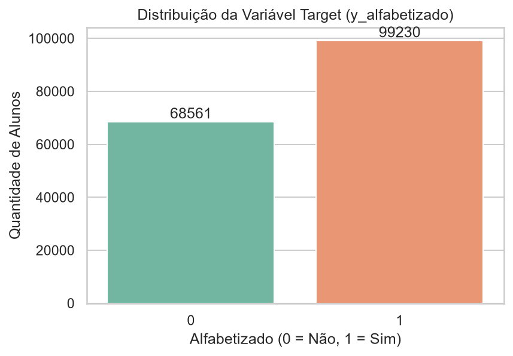
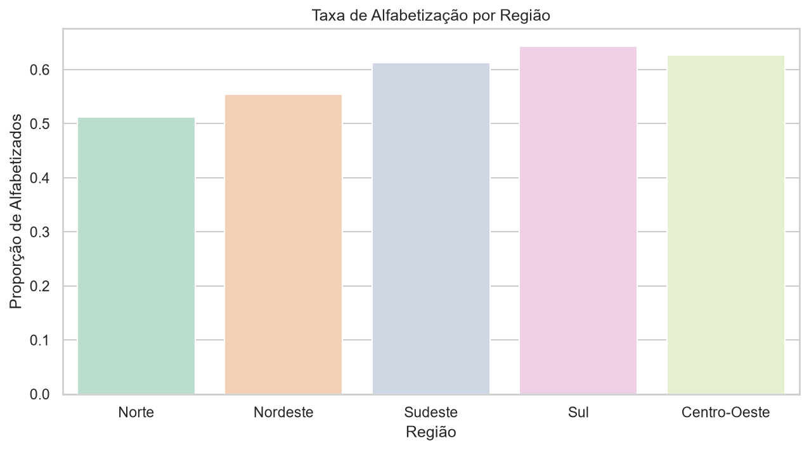
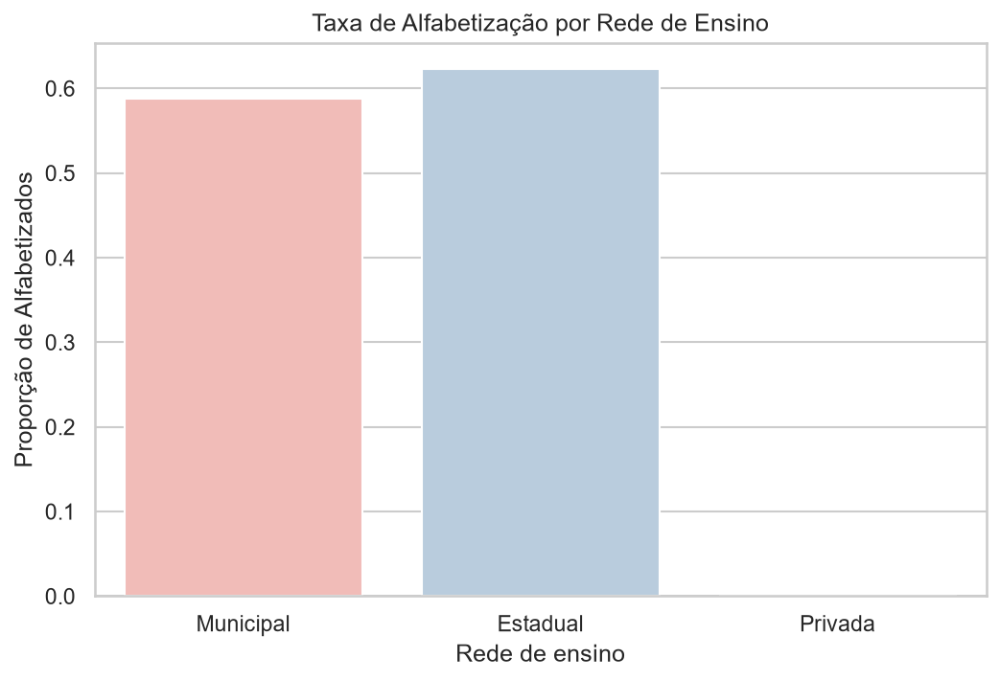
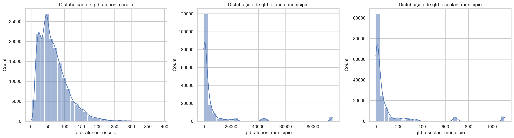
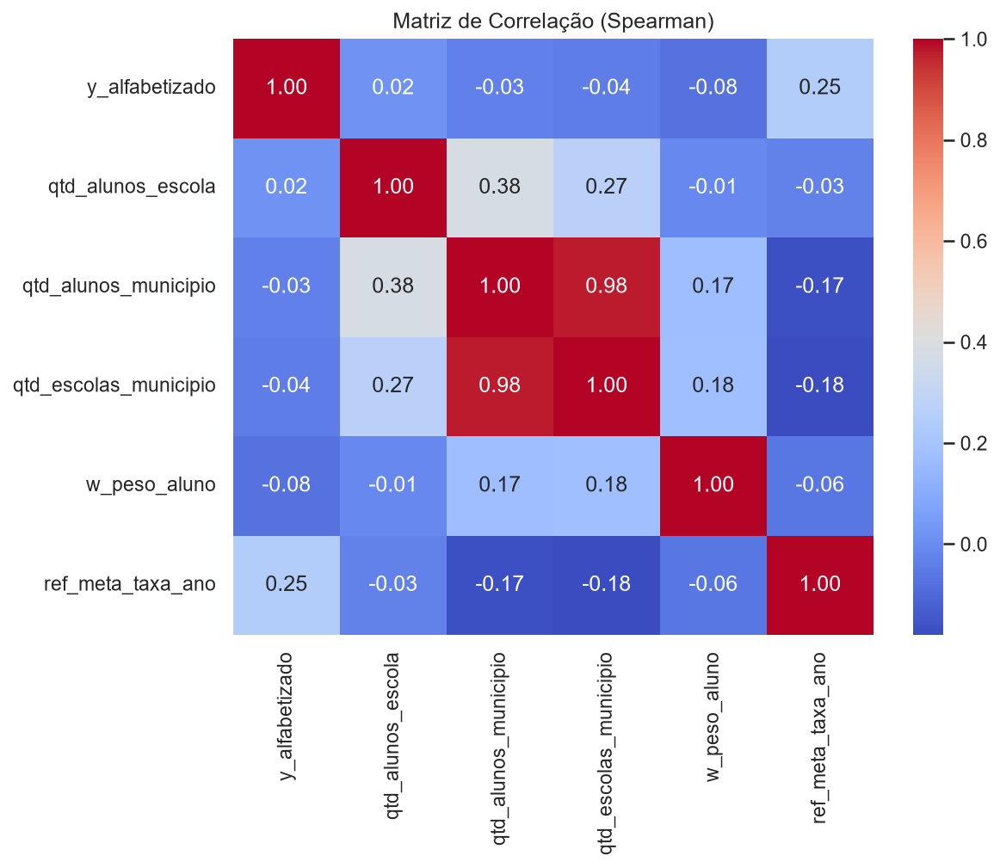

# Relatório 01 — Análise Exploratória dos Dados

Fonte: [`notebooks/02_eda.ipynb`](../notebooks/02_eda.ipynb) · Tabelas: [`tabelas/`](tabelas)

---

## 1. A base

A base analítica é uma amostra determinística de 5% da tabela
`gold.alunos_features`, com **167.791 alunos** e **17 colunas**, cobrindo
**5.173 municípios**. Cada linha é um aluno avaliado, com variáveis
territoriais (região, UF, município), de rede de ensino e de porte
(quantidade de alunos e escolas).

## 2. Variável alvo

| Classe | Alunos | Proporção |
| --- | ---: | ---: |
| 1 — Alfabetizado | 99.230 | **59,14%** |
| 0 — Não alfabetizado | 68.561 | **40,86%** |

A base é **naturalmente balanceada**. Isso tem duas consequências práticas para
a modelagem: não é necessário recorrer a reamostragem sintética (SMOTE) ou a
pesos de classe, e métricas como **F1-Score** e **ROC-AUC** podem ser lidas
diretamente, sem as distorções típicas de bases desbalanceadas.

## 3. Disparidade regional

| Região | Taxa real de alfabetização |
| --- | ---: |
| Sul | 64,38% |
| Centro-Oeste | 62,73% |
| Sudeste | 61,29% |
| Nordeste | 55,38% |
| **Norte** | **51,19%** |

A diferença entre o Sul e o Norte é de **13,2 pontos percentuais**. É a
separação mais nítida encontrada na EDA e a principal razão pela qual as
variáveis territoriais dominam o modelo (ver [relatório 03](03_interpretabilidade_shap.md)).

## 4. Rede de ensino

| Rede | Taxa real | Alunos na amostra |
| --- | ---: | ---: |
| Estadual | 62,25% | 18.632 |
| Municipal | 58,75% | 149.158 |
| Privada | 0,00% | **1** |

> ⚠️ **Atenção ao ler o gráfico:** a barra da rede *Privada* representa **um
> único aluno** na amostra. A taxa de 0% não é um resultado — é ruído amostral.
> A comparação válida é apenas entre Estadual e Municipal, com vantagem de
> **3,5 pontos percentuais** para a rede estadual. Como a rede municipal
> concentra 89% dos alunos e a maior parte das escolas rurais e de pequenos
> municípios, a diferença provavelmente reflete estrutura e recursos, não
> qualidade docente.

## 5. Variáveis de porte

As três variáveis de porte (`qtd_alunos_escola`, `qtd_alunos_municipio`,
`qtd_escolas_municipio`) têm distribuição fortemente assimétrica à direita
(*long tail*): a grande maioria das escolas e municípios é pequena, com poucos
casos extremos de porte muito elevado (capitais e grandes centros urbanos).

Consequência para a modelagem: a média é um péssimo estimador central aqui, o
que justifica a **imputação por mediana** adotada na pipeline. Modelos de
árvore também lidam melhor com esse formato que modelos lineares, que
precisariam de transformação logarítmica.

## 6. Correlações

Correlação de Spearman com `y_alfabetizado` (escolhida no lugar de Pearson
porque as distribuições não são normais):

| Variável | Correlação |
| --- | ---: |
| `ref_meta_taxa_ano` | **+0,248** |
| `qtd_alunos_escola` | +0,017 |
| `qtd_alunos_municipio` | −0,034 |
| `qtd_escolas_municipio` | −0,043 |
| `w_peso_aluno` | −0,076 |

Duas leituras:

1. **As variáveis de porte são praticamente irrelevantes isoladamente**
   (|ρ| < 0,05). Isso não significa que sejam inúteis: significa que qualquer
   contribuição delas virá de **interações** com outras variáveis, não de uma
   relação linear direta.
2. **`ref_meta_taxa_ano` é a única com sinal apreciável** (+0,248). A meta
   municipal é construída a partir da taxa-base histórica do município, então
   ela funciona como um resumo do desempenho pregresso daquela localidade. Vale
   registrar que essa variável é nula para **89.570 alunos (53,4% da base)** —
   municípios sem meta cadastrada para o ano.

## 7. Decisões de modelagem derivadas da EDA

| Achado da EDA | Decisão tomada |
| --- | --- |
| Base balanceada (59/41) | Sem reamostragem; F1 e ROC-AUC como métricas principais |
| Relação linear fraca das numéricas | Descartar regressão logística como modelo principal |
| Sinal concentrado em categóricas de alta cardinalidade | Modelo baseado em árvores — **XGBoost** |
| Distribuições assimétricas | Imputação por **mediana** |
| `ref_meta_taxa_ano` com 53,4% de nulos | Imputação dentro da pipeline, nunca antes do split |
| `leak_proficiencia` define o target | Remoção obrigatória (data leakage) |

Continua em [Relatório 02 — Modelagem e Avaliação](02_modelagem_e_avaliacao.md).
