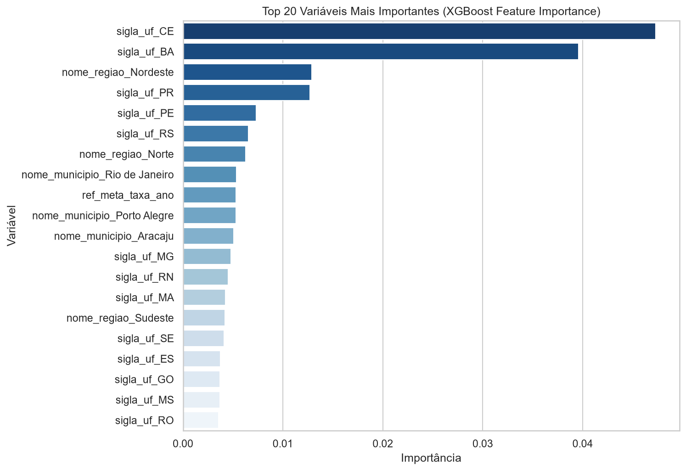
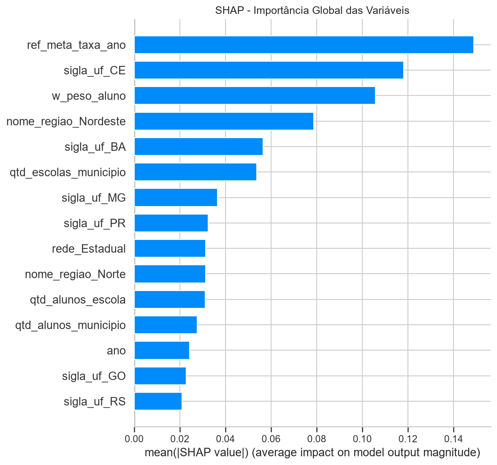

# Relatório 03 — Interpretabilidade e Aplicação Estratégica

Fonte: [`notebooks/04_shap_business.ipynb`](../notebooks/04_shap_business.ipynb) ·
Tabelas: [`tabelas/feature_importance_top20.csv`](tabelas/feature_importance_top20.csv), [`tabelas/shap_importance_top20.csv`](tabelas/shap_importance_top20.csv), [`tabelas/taxa_prevista_por_uf.csv`](tabelas/taxa_prevista_por_uf.csv)

---

## 1. Feature Importance nativa do XGBoost

| # | Variável | Importância |
| ---: | --- | ---: |
| 1 | `sigla_uf_CE` | 0,0473 |
| 2 | `sigla_uf_BA` | 0,0396 |
| 3 | `nome_regiao_Nordeste` | 0,0129 |
| 4 | `sigla_uf_PR` | 0,0127 |
| 5 | `sigla_uf_PE` | 0,0073 |
| 6 | `sigla_uf_RS` | 0,0065 |
| 7 | `nome_regiao_Norte` | 0,0063 |
| 8 | `nome_municipio_Rio de Janeiro` | 0,0053 |
| 9 | `ref_meta_taxa_ano` | 0,0053 |
| 10 | `nome_municipio_Porto Alegre` | 0,0053 |

## 2. SHAP — importância global

| # | Variável | \|SHAP\| médio |
| ---: | --- | ---: |
| 1 | `ref_meta_taxa_ano` | 0,1488 |
| 2 | `sigla_uf_CE` | 0,1181 |
| 3 | `w_peso_aluno` | 0,1058 |
| 4 | `nome_regiao_Nordeste` | 0,0787 |
| 5 | `sigla_uf_BA` | 0,0566 |
| 6 | `qtd_escolas_municipio` | 0,0538 |
| 7 | `sigla_uf_MG` | 0,0365 |
| 8 | `sigla_uf_PR` | 0,0325 |
| 9 | `rede_Estadual` | 0,0314 |
| 10 | `nome_regiao_Norte` | 0,0313 |

### Por que os dois rankings divergem

O `feature_importances_` do XGBoost mede o ganho médio que a variável produz
nos splits das árvores. O SHAP mede a contribuição marginal de cada variável
para **cada predição individual**, considerando interações. Quando uma variável
aparece em poucos splits mas com efeito grande sobre muitos alunos — como
`ref_meta_taxa_ano` e `w_peso_aluno` —, ela sobe no SHAP e afunda na
importância nativa. **O ranking do SHAP é o que deve orientar a leitura de
negócio.**

## 3. SHAP — direção do impacto

**1. `ref_meta_taxa_ano` (meta municipal) — a variável mais influente.**
Valores altos empurram fortemente a predição para "alfabetizado". Como a meta é
derivada da taxa-base histórica do município, essa variável funciona como um
resumo do desempenho pregresso da localidade: municípios que já iam bem
continuam indo bem. É persistência histórica, não efeito causal da meta.

**2. `sigla_uf_CE` — o Ceará como caso à parte.** O estado tem a maior taxa
prevista do país (**85,1%**), contra 66,4% de Minas Gerais e 72,3% do Paraná,
os dois seguintes entre os grandes. A distância é tão grande que "ser do Ceará"
virou a variável categórica mais discriminativa do modelo. Isso é consistente
com a literatura sobre o PAIC cearense, política de alfabetização na idade
certa iniciada em 2007 e frequentemente citada como referência nacional.

**3. `w_peso_aluno` — atenção metodológica.** O peso amostral aparece em 3º
lugar, e valores altos estão associados a menor probabilidade de alfabetização.
Segundo o dicionário de governança, essa coluna **não deveria ser feature** —
ela descreve o desenho da amostra, não o aluno. Parte do poder preditivo do
modelo está apoiada em um artefato do processo de coleta. Ver
[limitações](documentacao_tecnica.md#5-limitações-conhecidas).

**4. `nome_regiao_Nordeste` e `nome_regiao_Norte`.** Pertencer a essas regiões
reduz a probabilidade prevista. Não se trata de característica intrínseca da
região, e sim do reflexo estatístico de menor investimento histórico e de
condições socioeconômicas adversas.

**5. `rede_Estadual`.** Vantagem pequena, porém consistente, da rede estadual
sobre a municipal.

## 4. Respostas às perguntas de negócio

### Quais fatores mais impactam a alfabetização?

Em ordem de influência (SHAP): **o histórico do município** (representado pela
meta), **o estado**, **a região** e, com peso menor, **a rede de ensino** e o
**porte da rede escolar municipal**. Ou seja: na ausência de variáveis
individuais e pedagógicas, **o território explica quase tudo o que o modelo
consegue explicar**.

### Quais regiões apresentam maior risco educacional?

| Região | Taxa prevista |
| --- | ---: |
| Norte | 51,70% |
| Nordeste | 55,65% |
| Sudeste | 61,33% |
| Centro-Oeste | 62,85% |
| Sul | 64,03% |

Norte e Nordeste concentram o risco, com uma distância de 12,3 pontos
percentuais entre Norte e Sul.

### Quais estados puxam os extremos?

| Menores taxas previstas | | Maiores taxas previstas | |
| --- | ---: | --- | ---: |
| SE | 37,14% | CE | 85,14% |
| BA | 37,30% | PR | 72,26% |
| RN | 39,50% | ES | 70,20% |
| TO | 46,97% | GO | 69,93% |
| AL | 47,48% | MG | 66,39% |

O contraste mais revelador está **dentro do próprio Nordeste**: o Ceará lidera
o país com 85,1%, enquanto Sergipe, Bahia, Rio Grande do Norte e Alagoas ficam
abaixo de 48%. Isso é a evidência mais forte do projeto de que **política
pública estadual altera o resultado** — a região não é um destino.

### Qual rede tem pior desempenho?

| Rede | Taxa prevista |
| --- | ---: |
| Municipal | 58,91% |
| Estadual | 61,95% |

Diferença de 3 pontos. Como a rede municipal concentra 88,9% dos alunos da
amostra e a maior parte das escolas rurais e de pequeno porte, a disparidade
reflete estrutura e capacidade de financiamento.

### Quais municípios apresentam maior risco educacional?

| Município | UF | Taxa prevista | Alunos na amostra |
| --- | --- | ---: | ---: |
| Casa Nova | BA | 18,48% | 59 |
| Esplanada | BA | 22,73% | 40 |
| Pedrinhas | SE | 27,91% | 11 |
| Riachuelo | SE | 28,02% | 10 |
| Delmiro Gouveia | AL | 28,06% | 57 |
| Santa Cecília | PB | 28,17% | 4 |
| Paulo Afonso | BA | 28,52% | 97 |
| Pilão Arcado | BA | 28,56% | 33 |

Casa Nova (BA) é o caso mais extremo: menos de um em cada cinco alunos com
previsão de alfabetização.

### Quais regiões possuem padrões semelhantes?

O modelo agrupa naturalmente **Norte + Nordeste** (taxas entre 51% e 56%) e
**Sul + Sudeste + Centro-Oeste** (entre 61% e 64%) — com o Ceará como exceção
que rompe o padrão do próprio bloco.

A pergunta sobre **previsão de municípios que podem não atingir metas futuras**
é respondida no [Relatório 04](04_municipios_em_risco.md).
