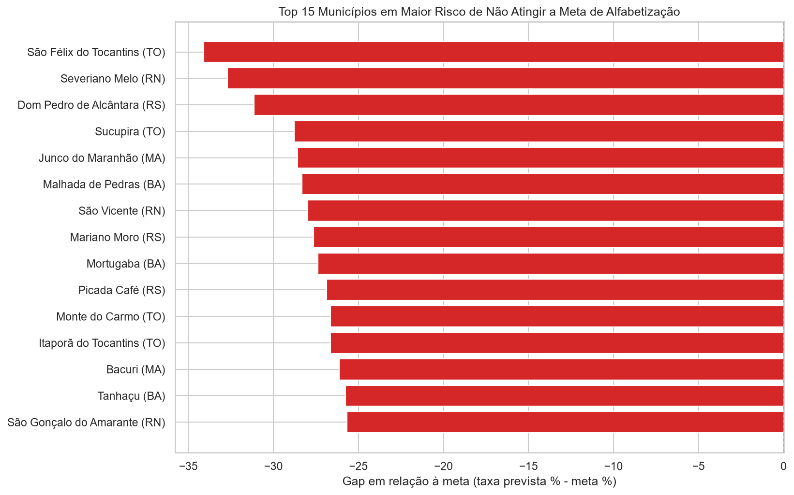

# Relatório 04 — Municípios em Risco de Não Atingir as Metas

Fonte: [`notebooks/05_metas_municipais.ipynb`](../notebooks/05_metas_municipais.ipynb) ·
Tabelas: [`tabelas/municipios_taxa_prevista_vs_meta.csv`](tabelas/municipios_taxa_prevista_vs_meta.csv), [`tabelas/municipios_em_risco_amostra_robusta.csv`](tabelas/municipios_em_risco_amostra_robusta.csv), [`tabelas/risco_por_regiao.csv`](tabelas/risco_por_regiao.csv)

---

## 1. Método

Para cada aluno da base completa, o modelo estima a probabilidade de
alfabetização. A média dessas probabilidades dentro de um município é a **taxa
de alfabetização prevista** daquela localidade. Comparando-a com a **meta
municipal** (`ref_meta_taxa_ano`), obtém-se o *gap*:

```
gap = taxa_prevista(%) − meta(%)          em_risco := gap < 0
```

Só entram na análise os municípios com meta cadastrada: **4.890 dos 5.173**
municípios da amostra.

## 2. Panorama

| Situação | Municípios | % |
| --- | ---: | ---: |
| **Em risco** (abaixo da meta) | **2.468** | **50,5%** |
| Dentro da meta | 2.422 | 49,5% |

Metade dos municípios brasileiros com meta cadastrada tende a não alcançá-la.

## 3. O paradoxo do Sul


| Região | Municípios | Em risco | % em risco | Meta média |
| --- | ---: | ---: | ---: | ---: |
| **Sul** | 940 | 647 | **68,8%** | 72,2 |
| Nordeste | 1.660 | 969 | 58,4% | 55,8 |
| Norte | 379 | 218 | 57,5% | 50,9 |
| Centro-Oeste | 435 | 160 | 36,8% | 65,4 |
| Sudeste | 1.476 | 474 | 32,1% | 63,9 |

À primeira vista o resultado contradiz todo o restante do projeto: o Sul tem a
**maior** taxa de alfabetização prevista (64,0%) e, ao mesmo tempo, a **maior**
proporção de municípios em risco (68,8%).

Não há contradição — há uma distinção que precisa ficar explícita para qualquer
gestor que leia este relatório:

> **"Estar em risco" não mede desempenho educacional. Mede a distância entre o
> desempenho previsto e a meta que aquele município assumiu.**

A meta média do Sul é de 72,2 pontos, contra 50,9 do Norte: **21 pontos de
diferença de ambição**. Municípios do Sul falham em relação a metas altas;
municípios do Norte cumprem metas baixas. Um município do Norte com meta de 50%
e taxa prevista de 52% aparece como "dentro da meta", embora quase metade de
seus alunos não esteja alfabetizada.

**Consequência prática:** as duas leituras devem ser usadas juntas. O
[Relatório 03](03_interpretabilidade_shap.md) responde *onde a alfabetização é
pior* (Norte e Nordeste); este responde *onde o compromisso assumido não será
cumprido* (Sul, Nordeste e Norte). Políticas diferentes para problemas
diferentes — e, no caso do Norte, a própria calibragem das metas deveria entrar
na discussão.

## 4. Top 15 — maior déficit absoluto



| Município | UF | Taxa prevista | Meta | Gap | Alunos |
| --- | --- | ---: | ---: | ---: | ---: |
| São Félix do Tocantins | TO | 45,9% | 80,0 | −34,1 | 3 |
| Severiano Melo | RN | 40,2% | 73,0 | −32,7 | 6 |
| Dom Pedro de Alcântara | RS | 48,9% | 80,0 | −31,1 | 1 |
| Sucupira | TO | 49,2% | 78,0 | −28,8 | 2 |
| Junco do Maranhão | MA | 51,4% | 80,0 | −28,6 | 9 |
| Malhada de Pedras | BA | 43,6% | 71,9 | −28,3 | 12 |
| São Vicente | RN | 37,8% | 65,8 | −28,0 | 6 |
| Mariano Moro | RS | 52,4% | 80,0 | −27,6 | 1 |
| Mortugaba | BA | 43,4% | 70,7 | −27,4 | 15 |
| Picada Café | RS | 53,1% | 80,0 | −26,9 | 2 |
| Monte do Carmo | TO | 44,9% | 71,6 | −26,6 | 7 |
| Itaporã do Tocantins | TO | 40,1% | 66,8 | −26,6 | 8 |
| Bacuri | MA | 43,5% | 69,7 | −26,1 | 14 |
| Tanhaçu | BA | 36,5% | 62,3 | −25,8 | 13 |
| São Gonçalo do Amarante | RN | 31,2% | 56,9 | −25,7 | 85 |

> ⚠️ Repare na última coluna. A amostra é de 5% dos alunos, então municípios
> pequenos aparecem com 1, 2 ou 3 alunos. Dom Pedro de Alcântara (RS) e Mariano
> Moro (RS) estão no ranking com **um único aluno** cada — a estimativa não tem
> massa amostral para orientar decisão alguma. **Este ranking não deve ser usado
> como lista de priorização.**

## 5. Lista priorizável — recorte robusto

Filtrando municípios com **pelo menos 30 alunos** na amostra, restam 1.081
municípios avaliáveis, dos quais **575 (53,2%) estão em risco**. Este é o
recorte que sustenta decisão:

| Município | UF | Taxa prevista | Meta | Gap | Alunos |
| --- | --- | ---: | ---: | ---: | ---: |
| São Gonçalo do Amarante | RN | 31,2% | 56,9 | −25,7 | 85 |
| Igrejinha | RS | 54,6% | 80,0 | −25,4 | 30 |
| Lajeado | RS | 52,3% | 75,5 | −23,2 | 77 |
| Farroupilha | RS | 57,8% | 80,0 | −22,2 | 84 |
| São Borja | RS | 45,7% | 67,8 | −22,1 | 42 |
| Canela | RS | 58,0% | 78,9 | −20,9 | 58 |
| Campo Bom | RS | 57,0% | 77,7 | −20,7 | 66 |
| Nova Viçosa | BA | 39,7% | 60,3 | −20,6 | 51 |
| Santa Cecília | SC | 48,1% | 68,6 | −20,5 | 34 |
| São Lourenço do Sul | RS | 59,0% | 79,2 | −20,2 | 32 |

A tabela completa está em
[`tabelas/municipios_em_risco_amostra_robusta.csv`](tabelas/municipios_em_risco_amostra_robusta.csv).

**São Gonçalo do Amarante (RN)** é o caso mais sólido da lista: 85 alunos na
amostra, taxa prevista de 31,2% e meta de 56,9%. Combina baixo desempenho
absoluto com alto déficit relativo — prioridade máxima pelos dois critérios.

## 6. Aplicação prática para políticas públicas

**1. Duas filas de priorização, não uma.**
*Emergência educacional* (taxa prevista mais baixa, independentemente da meta):
Casa Nova e Esplanada (BA), Delmiro Gouveia (AL), Paulo Afonso (BA).
*Descumprimento de compromisso* (maior gap com massa amostral): São Gonçalo do
Amarante (RN), Nova Viçosa (BA) e o conjunto de municípios gaúchos e catarinenses.

**2. Revisão da calibragem das metas.** Metas de 80,0 aparecem repetidamente
como teto aplicado de forma homogênea a municípios com realidades muito
distintas. Para um município com taxa prevista de 45%, uma meta de 80% não
orienta — desmobiliza. Metas escalonadas por ponto de partida tornariam o
monitoramento mais útil.

**3. O Ceará como política replicável.** Com 85,1% de taxa prevista em um
Nordeste que fica abaixo de 48% em quatro estados, o Ceará demonstra que o
resultado responde a política estadual coordenada. É o caso mais forte de
benchmarking interno do país.

**4. Uso operacional do modelo.** O pipeline gera probabilidade por aluno, o que
permite ranquear escolas e municípios **antes** do ciclo avaliativo seguinte e
alocar formação docente e material pedagógico de forma antecipada, em vez de
reativa.

## 7. Limitações desta análise

- **Circularidade parcial:** `ref_meta_taxa_ano` é usada como feature do modelo
  e, depois, como referência de comparação. O modelo já "viu" a meta ao estimar
  a taxa, o que atenua o gap medido. Uma versão futura deve treinar sem essa
  coluna para tornar a comparação independente.
- **Estimativas municipais instáveis** em localidades com poucos alunos na
  amostra de 5% — mitigado, mas não eliminado, pelo recorte da §5.
- **O modelo tem AUC de 0,667.** As taxas previstas são estimativas com
  incerteza relevante e devem ser tratadas como sinal de triagem, não como
  diagnóstico.
- **Municípios sem meta cadastrada (283) ficaram fora** da análise, e a ausência
  de meta pode ser, por si só, um indicador de fragilidade de gestão.
